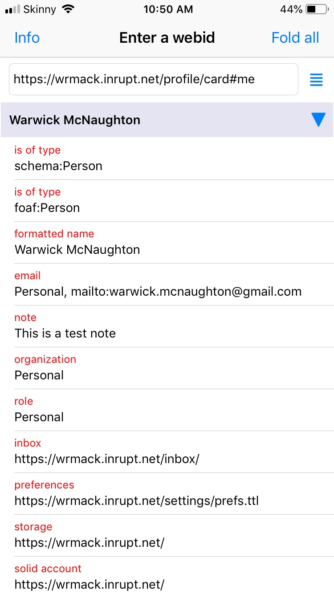

#  Solid profile browser

For iPhone.  

## Features
- enter a webid to browse a profile
- triples with a common subject are contained in separate table sections
- sections can be folded so easier to navigate 
- app maintains a 'recents' list to avoid having to re-type webids
- press on a table row to examine triple format
- app tries to assess whether the object is browseable and if so a link button is enabled to load it

## Limitations
- will not handle `http://` (must be a `https://` webid)
- when examing triple format, it is possible to edit the triple object; when Save is pressed the app will attemmpt to authenticate the user but a patched solid server is required for this

## Screenshot
 
 
